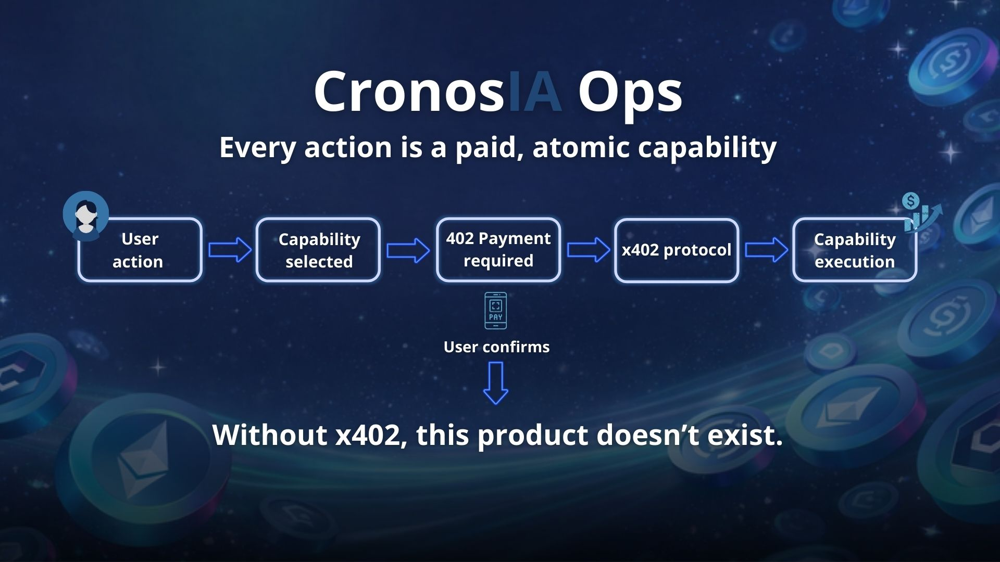

# CronosAI: AI-Powered Security Analysis on Cronos

**Pay-per-capability AI agent where each security analysis is an independently priced microservice, settled via x402 HTTP payment protocol.**

---

## What is CronosAI?

CronosAI demonstrates the x402 payment protocol in action: instead of generic "unlimited" API access, every capability has an explicit, transparent price paid in USDC.e. Users see exactly what they're paying for and can make granular economic decisions.

```
┌─────────────────────────────────────────────────────────────┐
│ "Is this swap safe?"                                        │
│                                                             │
│ CronosAI analyzes with:                                    │
│ ✓ Contract vulnerability scan        $0.01                │
│ ✓ Token approval safety check        $0.02                │
│ ✓ Transaction simulation             $0.03                │
│ ────────────────────────────────────────────────────────── │
│ Total: $0.06  [Confirm with MetaMask]                     │
└─────────────────────────────────────────────────────────────┘
```

**This product only makes sense with x402.** Without micropayments, it's just another free security scanner with no sustainable revenue model.

---

## Quick Demo (2 minutes)

### Prerequisites

- Node.js >= 18
- MetaMask wallet (testnet)
- Testnet tokens:
  - **TCRO**: [Get from faucet](https://cronos.org/faucet)
  - **devUSDCe**: Available on Cronos testnet explorer

### Setup

```bash
# Install dependencies
npm install

# Configure testnet
cp .env.testnet.example .env
# Edit .env with:
#   ANTHROPIC_API_KEY=sk-ant-... (from console.anthropic.com)
#   RECIPIENT_ADDRESS=0x...      (your MetaMask address)

# Start backend
npm run dev

# In another terminal, start frontend
cd web && npm run dev
```

Open http://localhost:5173 (UI shows "TESTNET" badge)

### Try It

1. Select a capability: **Contract Scan**, **Wallet Approvals**, or **Simulate Transaction**
2. Enter your target (contract address or token)
3. See the 402 payment request with breakdown
4. Confirm via MetaMask (signs EIP-3009 authorization)
5. Get results in real time

---

## Capabilities

| Capability | Price | Use Case |
|-----------|-------|----------|
| **Contract Scan** | $0.01 | Identify rug pulls, reentrancy, permission issues |
| **Wallet Approvals** | $0.02 | Find dangerous token approvals you've given |
| **Transaction Simulation** | $0.03 | Dry-run a swap before executing on-chain |

Each uses Claude to provide intelligent analysis, not just pattern matching.

---

## How x402 Works Here

1. **User requests a capability** (e.g., scan contract)
2. **Backend returns HTTP 402 Payment Required** with x402 header
3. **Frontend intercepts**, opens MetaMask for signature
4. **User signs EIP-3009 authorization** (no gas spent yet)
5. **Backend verifies signature**, executes on-chain transfer via @crypto.com/facilitator-client
6. **Payment settled on Cronos**, then capability executes
7. **Results returned to frontend**



This flow proves x402 can power real applications on Cronos.

---

## Architecture

| Component | Technology | Purpose |
|-----------|-----------|---------|
| **Backend** | Node.js + Express + TypeScript | API orchestration, x402 middleware |
| **AI Engine** | Claude API (Anthropic) | Analysis & security assessment |
| **Payment Layer** | x402 + @crypto.com/facilitator-client | Micropayment settlement |
| **Blockchain** | Cronos EVM + ethers.js | On-chain transfers |
| **Frontend** | React + Vite + TailwindCSS | User interface |

---

## Documentation

- **[Architecture](./docs/ARCHITECTURE.md)** - Technical design & payment flow
- **[Capabilities](./docs/CAPABILITIES.md)** - Detailed capability specs
- **[x402 Integration](./docs/X402.md)** - Payment protocol implementation
- **[Security](./docs/SECURITY.md)** - Wallet & network safety

---

## Why x402 Matters for Crypto

Traditional APIs (unlimited free, or subscription) don't work in DeFi:
- **Free tier** → bots + abuse → service dies
- **Subscription** → wrong model for occasional users
- **x402** → granular, transparent, blockchain-settled

CronosAI shows how x402 creates new economic primitives on Cronos where **each action has a price, and price is programmatically enforced.**

---

## Links

- [Cronos x402 Specification](https://docs.cronos.org/cronos-x402-facilitator)
- [Facilitator Client Docs](https://www.npmjs.com/package/@crypto.com/facilitator-client)
- [Claude API](https://docs.anthropic.com/claude/reference)
- [CronosIA Docs](https://siguil.gitbook.io/cronosai/)

---

## License

MIT
